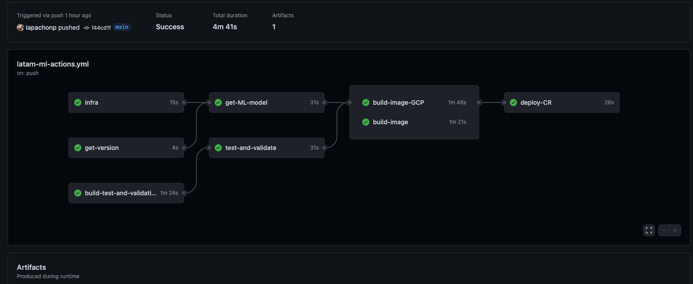

# latam-ML-infra

latam-ML-infra is a microservice that will predict the high or low probabilty of delay of a given flight id.  

## Architecture

 

The above architecture is being used and built for this project taking into account the following considerations:

* The current POC will use only one repository however it is a good practice to separate code and infrastructure repos, giving more control and decouple the code changes and the infrastructure changes.
* CICD uses extra custom images to test and validate the code, which have been added to the flow for convenience of the execercise however these imagesbashould have their own repo and deployment. 
* Authentication was designed but not developed, it will use a service account of IAM gcp which will give user or application the correct role and access to the service.
* Cloud run machine settings are set to default but can be configured based on the business requirements.

## Micro service usage 

You can find the docs of the available api calls in the following link:
[latam-ml-service](https://latam-ml-service-e4ixfink2a-uc.a.run.app/docs)

example: gets the prediction of the flight with id Vlo_l of 76 

```bash
curl -X 'POST' \                               ─╯
  'https://latam-ml-service-e4ixfink2a-uc.a.run.app/predict-flight' \
  -H 'accept: application/json' \
  -H 'Content-Type: application/json' \
  -d '{
  "Vlo_l": "76",
  "Fecha_l": "",
  "O_vlo": "",
  "O_fecha": "",
  "flight_type": "",
  "airline": ""
}'
```
output:
```bash
{"Prediction":"Low delayed probability"}
```
## Local development 

In order to work, develop or test new service capabilities or models, local environment is available:
please run at the base of the repo:

```bash 
docker-compose up --build -d 
```
you can check the service at http://localhost:8000/docs 

test new api calls or new ML models locally, and then pr main with your feature branch. 

take down the service whenever you are finished: 

```bash 
docker-compose down  
```

## Local test new ML models

New models can be tested by creating a new folder in the base of the repo:

```bash
mkdir ./Models
```
and dump the pickle file with the following name convetion:

```bash
touch Latam_flight_model.{$model_version}.pkl
```
where model_version should match the value of the local version file at the base of the repo:

run this to check your current version:
```bash
echo `cat ./version.txt`
```
## Gitflow strategy 

the following git flow will be followed:


once deployed to main the service will get deployed first into staging or QA environment in case extra test are needed and then into production.

## Test and Validations

### Tests

tests will be executed by pytest library and the tests can be created at:
```bash 
cd latam-ML-infra/src/tests/
```
name the test function starting with 
```python
def test_{your_python_func_name} :
  pass 
```
### Validations

code formatting and validations will be carried out by Black library: 

install the library and black your changes before committing or CI won't success:
```bash
pip install black==23.1.0 
```

other validations will be carried out by pylint ( TODO )


## wrk stress tests results 

### wrk test made:

```bash
./wrk -t12 -c5000 -d40s https://latam-ml-service-e4ixfink2a-uc.a.run.app/predict-flight
```

output:
```bash
Running 40s test @ https://latam-ml-service-e4ixfink2a-uc.a.run.app/predict-flight
  12 threads and 5000 connections
  Thread Stats   Avg      Stdev     Max   +/- Stdev
    Latency   137.67ms   55.07ms 590.51ms   90.49%
    Req/Sec   148.56     76.64   363.00     63.69%
  56731 requests in 40.09s, 22.18MB read
  Socket errors: connect 4754, read 0, write 0, timeout 238
  Non-2xx or 3xx responses: 56731
Requests/sec:   1414.99
Transfer/sec:    566.55KB
```

How to improve the response Latency and performance: 

* Use eventual consistency for the service, prioritizing availability of the service.
* Check and improve queries and database connections, using a good particioning approach. 
* Choose gcp region woth the lowest latency (network) based on the users location and add replicas. 

## SLIs & SLOs

The following SLIs and SLOs are a consideration of the most apropiate SLIs to take into account, specific SLOs must be set along with the users and the business, the following values and percentages are only a example: 

### Availability

Service will respond with a non 503 within 30 seconds from API calls for at least 99.5% of requests in the month. 

### Latency 

Service will respond within 250ms for at least 50% of requests in the month, and within 3000ms for at least 99% of requests in the month.


To measure these indicators we will use GCP SLO monitoring and create multiple alerts of the burn rate of the SLO so we can act quicker on problems rather than wait until the whole burn rate gets consumed.

example:

```terraform
resource "google_monitoring_custom_service" "customsrv" {
  service_id = "custom-srv-windows-slos"
  display_name = "My Custom Service"
}

resource "google_monitoring_slo" "windows_based" {
  service = google_monitoring_custom_service.customsrv.service_id
  display_name = "Terraform Test SLO with window based SLI"

  goal = 0.9
  rolling_period_days = 20

  windows_based_sli {
    window_period = "400s"
    metric_sum_in_range {
      time_series = join(" AND ", [
        "metric.type=\"monitoring.googleapis.com/uptime_check/request_latency\"",
        "resource.type=\"uptime_url\"",
      ])

      range {
        max = 5000
      }
    }
  }
}
```
in which the request latency is being measured against the total uptime of the service (service in good queality) 
with a goal of 90% in a 400s window for 20 days, in case this slo does not meet the taget the team will be notified.

## Authentication

### Internal users 

Users and apps will use a service account of IAM gcp which will give them the correct role (Cloud Run Invoker) and access to the service.

### External users

if external access users are needed (out of the organization) Firebase Authentication and identity Platform SDK can be used to authenticate external and internal users. 
Allowing also new features such as: 
* Multifactor Authentication
* Phone number Authentication
* Federated identity provider integration (google, Facebook, Github, Twitter, etc)
* Email and password based authentication 


## CICD 

CICD will be performed by github actions.
Configuration can be found at:
```bash
cat .github/workflows/latam-ml-actions.yml 
```
Please follow this [CICD](https://github.com/Iapachonp/latam-ML-infra/actions) to check the builds. 

### Graph 
 


